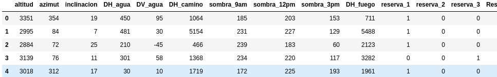
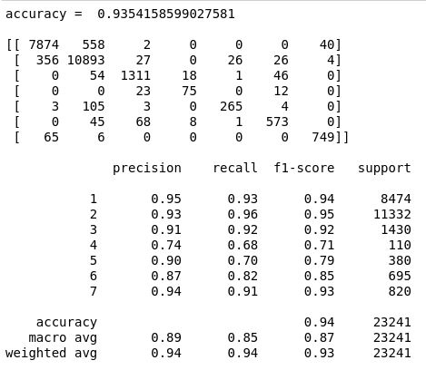

# Pattern recognition (Part 3/4)

#### 👨‍🎓 This project was carried out during my master's degree in computer vision at URJC - Madrid 

The objective of this exercise is to build a multi-class classifier capable of correctly predicting 7 different types of terrain.

The measures are: altitude, azimuth, slope, DH_water (horizontal distance to a water source),
DV_water (vertical distance to a water source), DH_road (horizontal distance to a road),
shade_9am, shade_12pm, shade_3pm, DH_fire (horizontal distance to a potential fire source),
reserve_1, reserve_2, reserve_3, reserve_4, t1, t2, t3, t4, t5, t6, t7, t8, t9, t10, t11, t11,
t12, t13, t14, t15, t16, t17, t18, t19, t20, t21, t22, t23, t24, t25, t26, t27, t28, t29, t30,
t31, t32, t33, t34, t35, t36, t37, t38, t39, t40. Characteristics reservation_1 to reservation_4
refer to whether the land is on a Native American reservation. Native American reservation.
Characteristics t1 to t40 indicate the presence of up to 40 different types of compounds on the site. of different compounds.

## Goals

- Construct a multi-class classifier with 50+ features.
- Have model score (accuracy) >= 0.8

## Requirements

* Python 3.9+


* jupyter~=1.0.0
* matplotlib ~= 3.3.4
* numpy ~= 1.21.3
* pandas ~= 1.4.2
* scikit_learn ~= 1.1.1
* seaborn ~= 0.11.2

How to install all the requirements :

```bash
pip3 install -r requirements.txt
```

## Usage

Execute only from project directory

```bash
jupyter notebook src/main.ipynb
```

## Structure

    .
    ├── datasets
    │        ├── reto3_testX.csv
    │        ├── reto3_trainX.csv
    │        └── reto3_trainY.csv
    ├── imgs
    │        ├── Figure_1.png
    │        ├── Figure_2.png
    │        └── Figure_3.png
    ├── model
    │        └── Model_24-07-22:39:36.sav
    ├── predictions
    │        └── reto3_Ypred.csv
    ├── README.md
    ├── requirements.txt
    ├── Reto3_2021.pdf
    └── src
        ├── bonus_extra_methods_tested.ipynb
        └── main.ipynb

## Examples

Example of the features given



PCA examples for one feature (tipo de bosque)


This is the result of the model (score = 0.9354)



## Authors

* **Luis Rosario** - *Member 1* - [Luisrosario2604](https://github.com/Luisrosario2604)
* **Vicent Gilabert Maño** - *Member 2* - [Vicent](https://github.com/vgilabert94)
